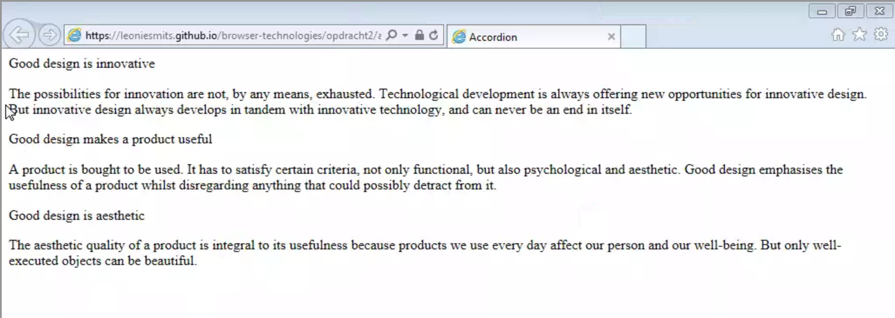
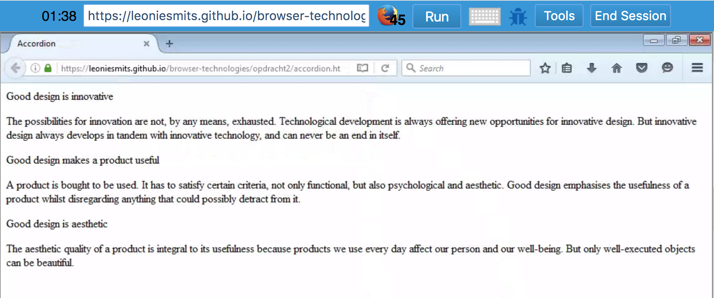
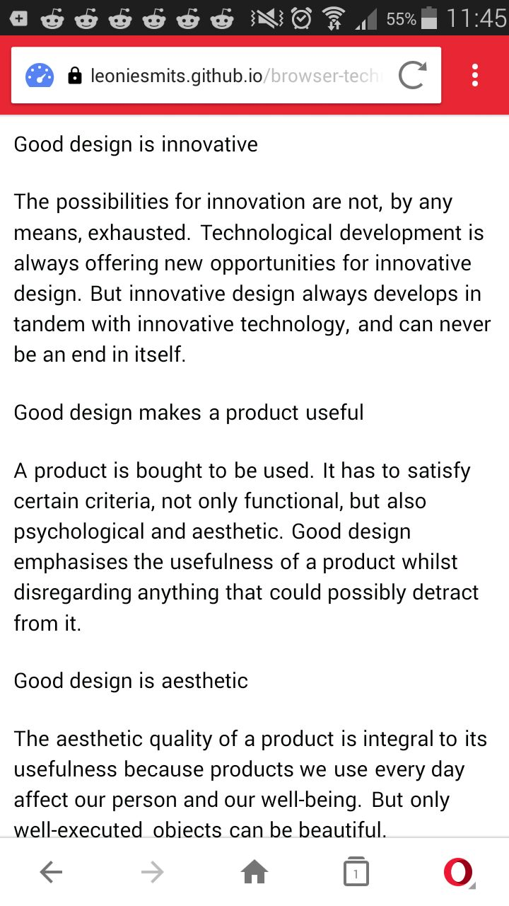

[link here](https://leoniesmits.github.io/browser-technologies/opdracht2/accordion.html)
# Browser Technologies
//Robuuste, toegankelijke websites leren bouwen …

## Opdracht 2 - 1, 2, 3 Feature Detectie
//Wat laat je zien als een browser of gebruiker 'enhancement' niet kan tonen of zien? Hoe doe je Feature Detection en wat doe je als een techniek niet werkt?

Werk 2 componenten uit in een demo. Je onderzoekt hoe je verschillende features door verschillende browsers worden ondersteund en hoe je voor goede fallback kan zorgen. Gebruik [html5test.com](https://html5test.com), [css3test.com](http://css3test.com) en [kangax.github.io/compat-table/es6/](https://kangax.github.io/compat-table/es6/)

- Per feature: Zoek uit hoe je deze kunt testen. Verzamel uitleg en artikelen. Bouw een (kleine) progressive enhanced demo (zonder extra tools, gewoon in 1 HTML file, zo simpel mogelijk). Test de feature (en fallback) op verschillende browsers en het Device Lab. Let op: Gebruik van polyfills is niet toegestaan.
- Post je 2 demo’s op GitHub met uitleg in een README file. Wat is de feature? Welke browsers/devices ondersteunen deze wel/niet? Hoe zorg je dat de fallback nuttig is?

Beoordelingscriteria
- 2 componenten zijn onderzocht en er is een demo gemaakt.
- De code staat in een repository op GitHub.
- Een Readme is toegevoegd met, per feature:
  -	Een beschrijving van de feature.
  - Bronnen van uitleg en gebruikte artikelen.
  -	Welke browsers/devices ondersteunen deze wel/niet.
  -	Een beschrijving hoe de fallback werkt.

## Feature: Accordion

The elements I used to achieve the accordion feature, are the `<details>` and `<summary>` HTML5 elements. The `<details>` element generates a widget to show and hide element contents by clicking on the `<summary>` element, which is its child.

#### Details & Summary elements
> Global usage % of all users = 89,65% 

browser | support | support since
-----|-------|--------------
Internet Explorer | no | - 
Edge | no | -
Firefox | yes | 2016
Chrome | yes | 2011
Safari | yes | 2012
Safari/Chrome iOS| yes | 2013
Opera Mini | no | -
Chrome for Android | yes | 2018
UC for Android| yes | 2016
Samsung Internet | yes | 2016

I made up the HTML like this and tested it in some browsers: 
```HTML
<section>
    <details>
        <summary>Good design is innovative</summary>
        <p>The possibilities for innovation are not, by any means, exhausted. 
            Technological development is always offering new opportunities for innovative design. 
            But innovative design always develops in tandem with innovative technology, and can never be an end in itself.</p>
    </details>
    <details>
        <summary>Good design makes a product useful</summary>
        <p>A product is bought to be used. It has to satisfy certain criteria, not only functional, but also psychological and aesthetic. 
            Good design emphasises the usefulness of a product whilst disregarding anything that could possibly detract from it.</p>
    </details>
    <details>
        <summary>Good design is aesthetic</summary>
        <p>The aesthetic quality of a product is integral to its usefulness because products we use every day affect our person and our well-being. 
            But only well-executed objects can be beautiful.</p>
    </details>
</section>
```

First I ofcourse tested this in my own browser, Chrome 65. I was surprised that this feature works with just HTML, no Javascript or styling needed. Then I started testing browsers that don't support these HTML elements.
I used [browserling](https://www.browserling.com/internet-explorer-testing) to test for IE9 (which was free, other versions were paid). I pushed this element on github and opened it in browserling.
Testing the accordion on Internet Explorer 9

On Firefox 45 (2016)

On Opera Mini


_On a side note; this element DOES work in .md files._
<details>How crazy is that</details>

#### Fixing the problem
First thing to do, was checking if the browser supports the `<details>` element. I found this [source](https://mathiasbynens.be/notes/html5-details-jquery) about a `<details>` fallback using jQuery from 2010. It had a vanilla JS solution, but stated that 
> "the `open` attribute is recognized, but doesn't support rendering the element correctly yet." 
So this is unreliable, but a start. 

```javascript
if (!('open' in document.createElement('details'))) {
 		document.documentElement.className += ' no-details';
  }
```
The first line checks if the browser supports the detail tag. That's what I need to proceed. 

```javascript
(function () {
    "use strict";
        if (!("open" in document.createElement("details"))) {
            var summary = document.getElementsByTagName("summary");
            for (var i = 0; i < summary.length; i++) {
                summary[i].parentNode.childNodes[3].classList.add("hidden");
                summary[i].addEventListener("click", function(e) {
                  parentNode.childNodes[3].classList.remove("shown")
                  this.parentNode.childNodes[3].classList.add("shown")
                })
            }
        }
    });
```
