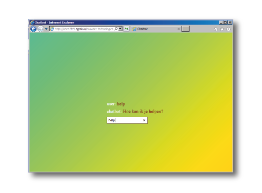

# Browser Technologies
//Robuuste, toegankelijke websites leren bouwen …

## Opdracht 3 - Progressive Enhanced Browser Technologies
Progressive enhancement is wanneer een applicatie wordt opgebouwd in lagen, waarbij de "core functionaliteit" de fundering is. Wanneer deze basis functionaliteit ongetwijfeld werkt in elk mogelijk scenario, worden er functionaliteiten toegevoegd om de gebruikerservaring te verbeteren. 

> Ik wil tegen de helpdesk kunnen klagen over een iframe-dat-het-niet-doet, en direct antwoord krijgen


### Core functionaliteit
Ik heb gekozen voor een helpdesk waarbij de gebruiker meteen antwoord krijgt. Dit werd een chatbot. In plaats van het probleem op te zoeken, is de gebruiker in gesprek en kan zijn vraag meteen stellen. Deze manier van communicatie en het verkrijgen van informatie zijn voor veel mensen toengankelijker dan deze informatie zoeken op een webpagina. 

>We’re going to see more and more companies implementing text natural language processing because chatbots create a close connection between them and their customers. [bron](http://www.belatrixsf.com/blog/chatbots-and-their-potential-to-help-people-with-disabilities/).

### Layered
De bedoeling is om layered the werken. Ik heb dit geprobeerd om te doen door een formulier te gebruiken en de antwoorden een voor een te tonen met CSS. Dit leek me heel omslachtig. Wel heb ik gezien hoeveel mogelijk is met het `<input>` element, bijvoorbeeld:
```html
<form>
  <label for="choose">Would you prefer a banana or a cherry?</label>
  <input id="choose" name="i_like" required pattern="banana|cherry">
  <button>Submit</button>
</form>
```
Er is hier gebruik gemaakt van het attribuut "required pattern", waardoor je de gebruiker alleen een bepaald antwoord laat intypen. Zo is bijvoorbeeld ook: `pattern="[a-z]{4,8}">` mogelijk. Hiermee laat je de gebruiker een woord van 4 tot 8 karakters typen, waarbij hij alle letters van a tot z kan gebruiken. [bron](https://developer.mozilla.org/en-US/docs/Learn/HTML/Forms/Form_validation)

Toch bleek ik javascript nodig te hebben voor deze chatbot. Natuurlijk werkt de site dan niet zonder javascript. Het vak Backend heb ik nooit gehad, waardoor ik het niet voor elkaar kreeg de code server side te laten werken. (En waardoor ik het vak Performance Matters niet heb gehaald.)

### Features
- Tekst naar spraak [Speech Synthesis - MDN](https://developer.mozilla.org/en-US/docs/Web/API/SpeechSynthesisUtterance)
- Animated gradient background [Animator](https://www.gradient-animator.com/)
- Compare input to answer array [Stackoverflow](https://stackoverflow.com/questions/25990634/javascript-how-do-i-compare-user-input-to-an-array)
- Try functionaliteit [Try - MDN](https://developer.mozilla.org/nl/docs/Web/JavaScript/Reference/Statements/try...catch)

## First Layer
Hoewel de code niet werkt zonder Javascript, is deze wel aangepast voor oudere browsers. Nu kan iemand op IE9 ook gewoon typen, op enter drukken en antwoord krijgen.

Hieronder is te zien hoe de demo werkt op IE11 in mijn Virtual Box.


## Second Layer
De gradient background wordt niet overal ondersteund, [maar wel op alle browsers sinds 2013.](https://caniuse.com/#search=linear) Er is een fallback boven de CSS die de gradient en de animatie genereert, zodat de pagina blauw is op hele oude browsers.

Hier is de pagina te zien op Internet Explorer 8 in mijn Virtual Box.


Dan is er nog [Speech Synthesis.](https://developer.mozilla.org/en-US/docs/Web/API/SpeechSynthesisUtterance) Deze API leest de tekst voor aan de gebruiker.  


